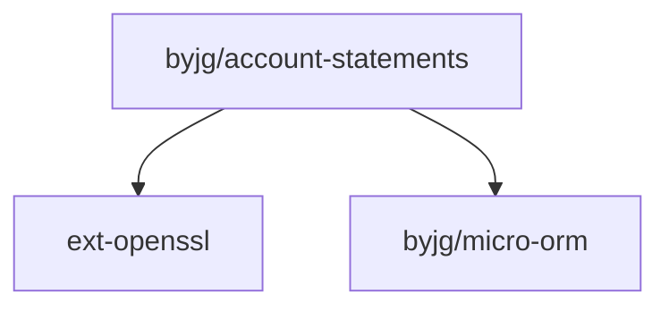

# Basic PHP Account Statements

This is a simple PHP application that allows you to create and manage account statements. It consists of a set of classes to allow control and get statements of any account.

It supports the following features:

- Multiple accounts per user;
- Multiple currencies per account
- Transaction history to avoid changes in the balance;

## How to use

### Installation

```bash
composer require "byjg/account-statements"
```

### Basic usage

```php
use ByJG\AccountStatements\Bll\AccountBLL;
use ByJG\AccountStatements\Bll\AccountTypeBLL;
use ByJG\AccountStatements\Bll\StatementBLL;
use ByJG\AccountStatements\Entity\AccountTypeEntity;
use ByJG\AccountStatements\Repository\AccountRepository;
use ByJG\AccountStatements\Repository\AccountTypeRepository;
use ByJG\AccountStatements\Repository\StatementRepository;
use ByJG\AccountStatements\DTO\StatementDTO;


// Initiate Repositories
$accountTypeRepo = new AccountTypeRepository($this->dbDriver);
$statementRepo = new StatementRepository($this->dbDriver);
$accountRepo = new AccountRepository($this->dbDriver);

// Initiate BLLs
$accountTypeBLL = new AccountTypeBLL($accountTypeRepo);
$statementBLL = new StatementBLL($statementRepo, $accountRepo);
$accountBLL = new AccountBLL($accountRepo, $accountTypeBLL, $statementBLL);

// Create a new Account Type
$accountType = new AccountTypeEntity();
$accountType->setAccountTypeId('USD');
$accountType->setName('Dollar Account');

$accountTypeBLL = new AccountTypeBLL($accountTypeRepo);
$accountTypeBLL->update($accountType);

// Create a new Account
$accountRepo = new AccountRepository($this->dbDriver);
$accountId = $accountBLL->createAccount($accountType->getAccountTypeId(), '34', 0);

// Add 200 USD to the account
$statement = new StatementDTO($accountId, 200);
$statementBLL->addFunds($statement);

// Withdraw 100 USD from the account
$statement = new StatementDTO($accountId, 100);
$statementBLL->withdrawFunds($statement);

// Add 50 USD hold to the account
$statement = new StatementDTO($accountId, 50);
$statementId = $statementBLL->reserveFundsForDeposit($statement);

// Accept the hold
$statementBLL->acceptFundsById($statementId);
```

## Installation

```bash
composer require byjg/account-statements
```

## Testing

```bash
docker run --name mysql-container --rm  -e MYSQL_ROOT_PASSWORD=password -p 3306:3306 -d mysql:8.0
vendor/bin/phpunit
```


## Dependencies  



----  
[Open source ByJG](http://opensource.byjg.com)

@todo Documentation
@todo Rest
